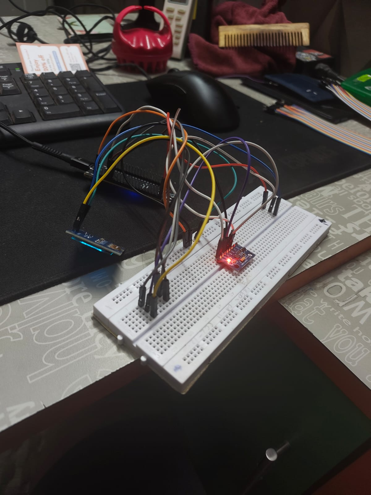
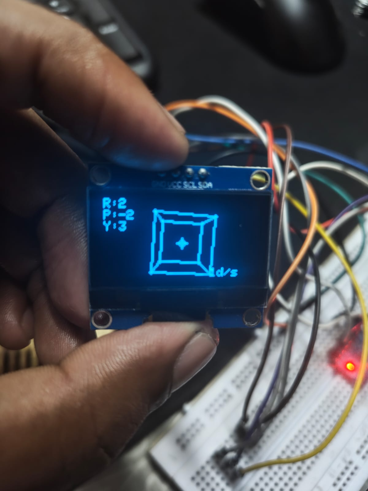

# TinyML Research Reproduction

## Part 1 · Hardware & Sensor Validation

### Building the foundation for embedded vibration anomaly detection

As the first stage of my TinyML research reproduction, I began by rebuilding and validating the sensing layer of a research system designed for detecting abnormal motor vibrations using machine learning on embedded hardware.

The reference research uses an **MPU6050 inertial measurement unit (IMU)** to capture vibration data and an embedded microcontroller to process the signal before performing machine-learning-based anomaly detection.

Rather than immediately jumping into the ML model, I approached the reproduction from the hardware upward:

**Sensor → Data → Signal Understanding → Processing → TinyML**

This first stage focused on making the sensor reliable, understanding its raw measurements, and creating a visual interface to verify its behaviour.

---

## Hardware Setup

The prototype is built around an **ESP32-S3 N8R8**, an **MPU6050**, and a **1.3-inch 128×64 SH1106 OLED**.

The MPU6050 communicates with the ESP32-S3 through I²C:

| Device      | Connection |
| ----------- | ---------- |
| MPU6050 VCC | 3.3V       |
| MPU6050 GND | GND        |
| MPU6050 SDA | GPIO 11    |
| MPU6050 SCL | GPIO 12    |
| MPU6050 AD0 | GND        |
| OLED VCC    | 3.3V       |
| OLED GND    | GND        |
| OLED SDA    | GPIO 11    |
| OLED SCL    | GPIO 12    |

Both devices share the same I²C bus, with the MPU6050 operating at **0x68** and the OLED at **0x3C**.

### Prototype

---

## Validating the MPU6050

Before moving toward machine learning, I first verified that the sensor could actually communicate with the ESP32-S3 and provide usable measurements.

An I²C scan successfully detected the MPU6050 at:

`0x68`

I then moved beyond library-level initialization and accessed the sensor directly through its registers.

One interesting debugging observation was that the device returned:

`WHO_AM_I = 0x70`

rather than the commonly expected `0x68`.

Despite this, the measurement and configuration registers responded correctly and the sensor produced usable accelerometer and gyroscope data.

This led me to use **direct register communication** rather than depending on the MPU6050 library that was reporting the device as unavailable.

---

## Understanding the Motion Data

The MPU6050 provides two different types of motion information:

**Accelerometer**

* X-axis acceleration
* Y-axis acceleration
* Z-axis acceleration

**Gyroscope**

* X-axis angular velocity
* Y-axis angular velocity
* Z-axis angular velocity

The accelerometer provides information about acceleration and the gravity vector, while the gyroscope measures rotational velocity.

Understanding this distinction became important when I started visualizing the sensor data.

---

## The First Problem: A Cube That Wouldn't Stop Rotating

My first attempt at creating a 3D visualization used the accelerometer values directly to update the cube's rotation.

The result looked reasonable while moving the sensor, but the cube continued rotating even after the board was held still.

The problem was in the interpretation of the accelerometer data.

A stationary accelerometer still measures gravity. Therefore, continuously accumulating its readings as rotational movement effectively told the cube:

> "Keep rotating."

This was the first major lesson of the reproduction:

**Acceleration is not the same thing as rotation.**

The visualization exposed a problem that would have been much harder to notice from raw numerical readings alone.

---

## Moving to Sensor Fusion

To create a more meaningful representation of physical movement, I separated the roles of the accelerometer and gyroscope.

The new pipeline became:

**MPU6050 → Accelerometer + Gyroscope → Sensor Fusion → Orientation → 3D Renderer → OLED**

The gyroscope provides fast rotational information, while the accelerometer provides a gravity-based reference for roll and pitch.

I combined them using a **complementary filter** with:

`α = 0.98`

The resulting orientation estimate provides:

* Roll
* Pitch
* Yaw

Roll and pitch are corrected using the accelerometer's gravity reference, while yaw is primarily obtained through gyroscope integration.

Because the MPU6050 does not contain a magnetometer, yaw naturally experiences drift over time.

---

## Real-Time 3D Visualization

The processed orientation data is rendered as a compact wireframe cube on the 128×64 OLED.

The cube is represented using eight 3D vertices. Each vertex passes through the rotation calculations before being projected onto the 2D OLED.

The rendering pipeline is:

**3D coordinates → X/Y/Z rotation → Perspective projection → 2D OLED coordinates**

The display simultaneously shows the estimated orientation values, allowing the physical movement of the breadboard to be compared directly with the graphical response.

This turned the OLED into more than a display. It became a debugging instrument for the IMU.

---

## Why This Stage Matters to the TinyML Reproduction

The final objective is not simply to display orientation.

The research system operates on vibration data, so the next stages require a reliable acquisition pipeline.

The reference research describes vibration acquisition at **100 Hz**, followed by short-window signal processing and feature extraction before machine-learning inference.

My reproduction therefore follows a similar progression:

**MPU6050**

↓

**100 Hz vibration acquisition**

↓

**Signal windowing**

↓

**FFT**

↓

**Feature extraction**

↓

**TinyML model**

↓

**Anomaly detection**

The current OLED visualization is an intermediate validation stage that allows me to understand the sensor and verify the embedded pipeline before introducing the machine-learning component.

---

## What I Learned From Part 1

This stage reinforced an important principle of embedded AI development:

**The machine-learning model is only as reliable as the data pipeline feeding it.**

Before attempting TinyML inference, I needed to establish that:

* The sensor communicates reliably.
* The correct I²C addresses are being used.
* Raw measurements can be read directly.
* Accelerometer and gyroscope data are interpreted correctly.
* Sensor bias is accounted for.
* Orientation can be estimated coherently.
* The microcontroller can process and visualize the data in real time.

With the sensing layer validated, the project is now ready to move from **understanding the sensor** to **understanding the vibration signal itself**.

---

## Next: Part 2 · Signal Processing

The next stage of the reproduction will focus on the actual vibration-analysis pipeline:

**100 Hz Sampling → Windowing → 16-point FFT → Frequency Analysis → Feature Extraction**

From there, the extracted features will become the input to the TinyML classification and anomaly-detection stages.

The goal is to progressively reproduce the complete research pipeline on embedded hardware rather than treating the neural network as an isolated component.
